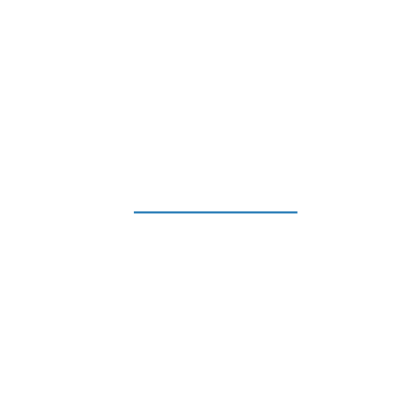

# Mathematical Model of a neuron:

A neuron can be modeled as a function  $f$  that takes a vector of inputs  $\mathbf{x}$  and produces an output  $\mathbf{y}$ .  
The function  $f$ consists of two main parts: 
 - The linear combination of inputs and weights, and 
 - The application of an activation function. 
 
Here’s the step-by-step breakdown:

### 1. Linear Combination (Affine Transformation)

This is the first step where the inputs are combined with the corresponding weights and a bias is added.

- **Equation**: 
$z = \mathbf{w}^\top \mathbf{x} + b$

- **Variables**:
    - $\mathbf{x}$ is the vector of inputs $[x_1, x_2, \ldots, x_n]$,
    - $\mathbf{w}$ is the vector of weights $[w_1, w_2, \ldots, w_n]$,
    - $b$ is the bias,
    - $z$ is the weighted sum.

The multiplication of the weights and inputs can be expanded as:

$z = w_1 \cdot x_1 + w_2 \cdot x_2 + \ldots + w_n \cdot x_n + b$

This represents the dot product of the weights vector $\mathbf{w}$ with the inputs vector $\mathbf{x}$, followed by adding the bias $b$.

### 2. Activation Function

The weighted sum $z$ is then passed through an activation function $g$ to introduce non-linearity and make complex pattern learning possible.

- **Activation Function Application**:  

  $\mathbf{y} = g(z)$

  where
  - $g$ is the activation function (e.g., sigmoid, tanh, ReLU),
  - $\mathbf{y}$ is the output of the neuron.

### Combined Neuron Function

Combining the above components, the function of a neuron $f$ can be described as:

$f(\mathbf{x}) = g(\mathbf{w}^\top \mathbf{x} + b)$

This function encapsulates the entire operation of a neuron in an ANN, from input to output. It highlights how each neuron processes its inputs to produce an output that is dependent on both the learned parameters (weights and biases) and the chosen non-linear transformation (activation function).

### Why we need an activation function?

Imagine the line in animation below before applying the sine distortion. 

The transformation applied to it (rotations) is purely linear, it’s simply being rotated around the origin. While this creates visually interesting rotations, the line remains straight, and its fundamental properties do not change significantly. In terms of neural networks, this corresponds to stacking linear transformations. Even multiple layers of linear transformations can only represent linear mappings of the input, which severely limits the network’s ability to model complex relationships.

Now, notice what happens when the sine distortion is applied to the line. 

The previously straight line becomes warped and curved in intricate ways. This distortion introduces non-linearity: a transformation that bends and reshapes the line in ways that could not be achieved through rotation (linear transformations) alone. Similarly, in neural networks, the activation function serves as this non-linear transformation, enabling the network to map inputs to outputs in more flexible and complex ways.

Just as the sine distortion makes it possible to create intricate shapes, non-linear activation functions like sigmoid, ReLU, or tanh serve a similar purpose. They allow the model to “bend” the decision boundaries and learn non-linear mappings, enabling it to approximate highly complex functions and solve real-world tasks

